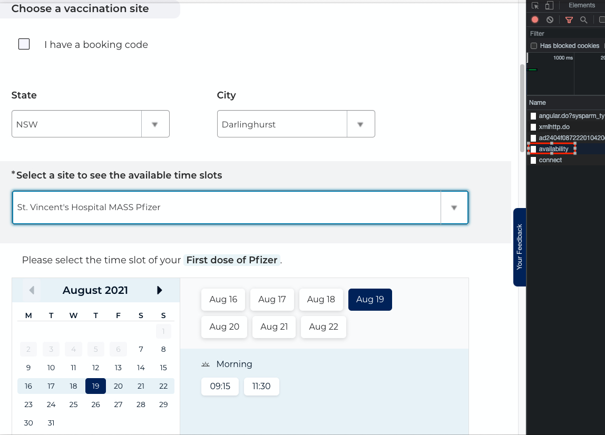

## Vaccine Tracker

###
Step1: login to nswhavam.health.nws.gov.au

Step2: find the api call to `https://nswhvam.health.nsw.gov.au/api/sn_vaccine_sm/appointment/availability` using Chrome network debugging tool when you select a center

Step3: create a .env file copy the cookies and user_token from the header of above call  

Step4: replace line 21 - line 23 with your request payload from above api call 
