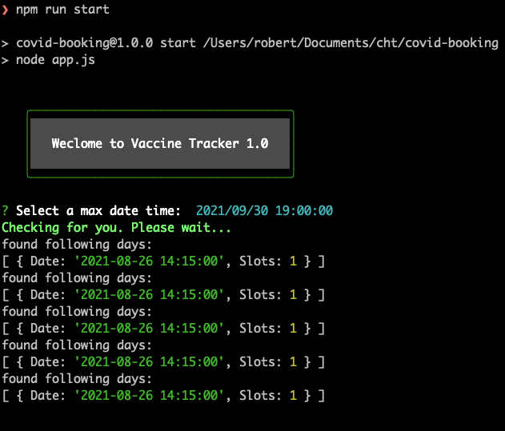

## Vaccine Tracker

###
Step1: login to nswhavam.health.nws.gov.au

Step2: find the api call to `https://nswhvam.health.nsw.gov.au/api/sn_vaccine_sm/appointment/availability` using Chrome network debugging tool

Step3: create a .env file put the cookies and usre_token  

Step4: replace line 21 - line 23 with your own payload body

